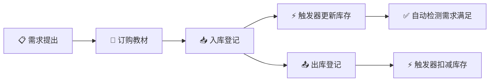

# 📚 教材管理系统 (TextBook Management System)

一个基于 **Spring Boot 3.2 + SQL Server** 的教材进销存管理系统，前端为纯 HTML/CSS/JS 单页应用（SPA），支持教材库存管理、需求追踪、入库出库、订单管理及多角色权限控制。

---

## 📁 项目结构

```
TextBookManagement/
├── frontend/                         # 前端（单页应用）
│   ├── index.html                    # 应用入口页面
│   ├── css/
│   │   └── style.css                 # 全局样式（玻璃拟态设计风格）
│   ├── js/
│   │   ├── api.js                    # API 请求封装（Fetch API，已对接所有后端接口）
│   │   ├── app.js                    # 主应用逻辑（登录/欢迎屏/导航/视差背景/Reveal 动画）
│   │   └── router.js                 # 单页滚动路由 & 各模块 HTML 模板渲染
│   └── images/                       # 背景与装饰图片
│
├── textBook.sql                      # 数据库初始化脚本
├── 启动后端.bat                       # 一键启动后端
├── backend/                          # 后端（Spring Boot）
│   ├── pom.xml                       # Maven 依赖配置
│   └── src/main/
│       ├── java/com/textbook/
│       │   ├── TextbookApplication.java   # Spring Boot 启动类
│       │   ├── common/                    # 通用模块
│       │   │   ├── GlobalExceptionHandler.java  # 全局异常处理
│       │   │   ├── PageResult.java              # 分页响应封装
│       │   │   └── Result.java                  # 统一 API 响应封装
│       │   ├── config/                    # 配置层
│       │   │   ├── CorsConfig.java              # CORS 跨域配置
│       │   │   ├── JwtAuthenticationFilter.java  # JWT 认证过滤器
│       │   │   └── SecurityConfig.java          # Spring Security 安全配置
│       │   ├── controller/                # REST API 控制器（9 个）
│       │   │   ├── AuthController.java          # 登录认证
│       │   │   ├── BookController.java          # 教材 CRUD
│       │   │   ├── DemandController.java        # 需求管理
│       │   │   ├── OrderController.java         # 订购管理
│       │   │   ├── PublisherController.java     # 出版社管理
│       │   │   ├── StatisticsController.java    # 统计报表
│       │   │   ├── StockInController.java       # 入库操作
│       │   │   ├── StockOutController.java      # 出库操作
│       │   │   └── TypeController.java          # 教材类型
│       │   ├── model/
│       │   │   ├── dto/                    # 数据传输对象（请求/响应）
│       │   │   └── entity/                 # 数据库实体类（12 个）
│       │   ├── service/                   # 业务逻辑层（9 个 Service）
│       │   └── util/                      # 工具类（JWT 等）
│       └── resources/
│           └── application.yml            # 数据库连接、JWT 密钥、日志配置
│
└── README.md                        # 本文件
```

---

## ✨ 功能模块

| 模块 | 说明 |
|------|------|
| 🔐 **登录认证** | JWT Token 认证，RBAC 四角色权限体系（Admin / DemandProvider / StockOperator / Viewer） |
| 📊 **仪表盘** | Canvas 环形饼图展示教材类型分布 + 库存统计摘要卡片 |
| 📋 **需求管理** | 创建教材需求 → 订购 → 入库 → 触发器自动检测满足状态 |
| 📚 **教材管理** | 按类型卡片展开教材列表，支持搜索、添加、编辑、删除 |
| 🏢 **出版社管理** | 出版社的增删改查 |
| 🛒 **教材订购** | 基于需求创建订购单，追踪订购状态 |
| 📥 **入库管理** | 待入库列表 → 提交入库（触发器自动更新库存） |
| 📤 **出库管理** | 出库登记（触发器自动扣库存，库存不足时拦截报错） |
| 📈 **统计报表** | 存储过程 `TextBookStatistics` 统计各教材的订购/入库/出库汇总 |

---

## 🛠️ 技术栈

| 层级 | 技术 | 版本 |
|------|------|------|
| 前端 | HTML5 + CSS3 + 原生 JavaScript（SPA 单页滚动架构） | — |
| 后端框架 | Spring Boot | 3.2.0 |
| 安全框架 | Spring Security + JWT (jjwt) | 0.12.3 |
| 数据库 | SQL Server（触发器 + 存储过程） | 2019+ |
| 数据库访问 | JdbcTemplate（直接编写 SQL） | — |
| 工具库 | Lombok、Spring Validation | — |
| 构建工具 | Maven | 3.9+ |
| Java 版本 | JDK | 17 |

---

## 🚀 快速开始

### 1. 环境要求

| 组件 | 版本要求 | 说明 |
|------|----------|------|
| JDK | 17+ | 推荐 [Eclipse Temurin](https://adoptium.net/) |
| Maven | 3.9+ | 已安装至 `D:\Java\maven` |
| SQL Server | 2019+ | 本地或远程，默认端口 1433 |
| 浏览器 | Chrome / Edge 最新版 | 用于访问前端页面 |

### 2. 数据库初始化

在 SQL Server Management Studio（SSMS）或 sqlcmd 中打开 `textBook.sql`，**按顺序依次执行**以下五个部分：

| 步骤 | 内容 | 说明 |
|------|------|------|
| 第一部分 | 删除旧表 | 按外键依赖倒序 DROP，清理旧数据 |
| 第二部分 | 创建新表 | 建表（Users → Roles → ... → TextBooks） |
| 第三部分 | 插入基础数据 | 角色、权限、默认用户 |
| 第四部分 | 创建触发器 | StockInUpdate / StockOutUpdate / DemandAutoFulfill |
| 第五部分 | 创建存储过程 | TextBookStatistics |

> 验证：执行 `SELECT * FROM Users` 应返回 4 条默认用户记录。

### 3. 配置后端

编辑 `backend/src/main/resources/application.yml`，修改数据库连接：

```yaml
spring:
  datasource:
    # SQLEXPRESS 请用实际动态端口（SQL Server 配置管理器 → TCP/IP → IPAll 查看）
    # 默认实例请用 jdbc:sqlserver://localhost:1433
    url: jdbc:sqlserver://localhost:59440;databaseName=TextBookManagement;encrypt=false;trustServerCertificate=true
    username: sa                  # 修改为你的 SQL Server 用户名
    password: your_password       # 修改为你的 SQL Server 密码
```

### 4. 启动后端

双击 `启动后端.bat` 即可一键启动后端。

启动成功后窗口显示：
```
========================================
  教材管理系统后端启动成功！
  访问地址: http://localhost:8080
========================================
```

### 5. 启动前端

在 VS Code 中右键 `frontend/index.html` → **"Open with Live Server"**，浏览器打开 `http://127.0.0.1:5500`。

### 6. 登录测试

| 用户名 | 密码 | 角色 | 权限范围 |
|--------|------|------|----------|
| `admin` | `admin123` | 管理员 (Admin) | 全部 29 个权限 |
| `demander` | `123456` | 需求提出者 (DemandProvider) | 需求管理 + 查看（11 个权限） |
| `stockop` | `123456` | 库存操作员 (StockOperator) | 教材/订购/入库/出库（19 个权限） |
| `viewer` | `123456` | 只读人员 (Viewer) | 仅查看（7 个权限） |

---

## 📡 API 接口一览

### 🔐 认证模块
| 方法 | URL | 说明 | 权限 |
|------|-----|------|------|
| POST | `/api/auth/login` | 用户登录，返回 JWT Token | 公开 |

### 📚 教材管理
| 方法 | URL | 说明 | 权限 |
|------|-----|------|------|
| GET | `/api/books?pageNum=&pageSize=&keyword=&typeId=` | 分页查询教材列表 | `book:view` |
| POST | `/api/books` | 添加新教材 | `book:create` |
| PUT | `/api/books/{id}` | 更新教材信息 | `book:edit` |
| DELETE | `/api/books/{id}` | 删除教材 | `book:delete` |

### 🏢 出版社管理
| 方法 | URL | 说明 | 权限 |
|------|-----|------|------|
| GET | `/api/publishers` | 获取出版社列表 | `publisher:view` |
| POST | `/api/publishers` | 添加出版社 | `publisher:create` |
| DELETE | `/api/publishers/{id}` | 删除出版社 | `publisher:delete` |

### 🏷️ 教材类型
| 方法 | URL | 说明 | 权限 |
|------|-----|------|------|
| GET | `/api/types` | 获取类型列表 | 登录即可 |

### 📥 入库管理
| 方法 | URL | 说明 | 权限 |
|------|-----|------|------|
| POST | `/api/stock-in` | 提交入库（触发器自动更新库存） | `stockin:create` |

### 📤 出库管理
| 方法 | URL | 说明 | 权限 |
|------|-----|------|------|
| POST | `/api/stock-out` | 提交出库（触发器扣库存，不足则回滚） | `stockout:create` |

### 🛒 订购管理
| 方法 | URL | 说明 | 权限 |
|------|-----|------|------|
| GET | `/api/orders` | 查询所有订购列表 | `order:view` |
| POST | `/api/orders` | 创建订购单 | `order:create` |
| DELETE | `/api/orders/{id}` | 删除订购单 | `order:delete` |

### 📋 需求管理
| 方法 | URL | 说明 | 权限 |
|------|-----|------|------|
| GET | `/api/demands?status=` | 查询需求列表 | `demand:view` |
| POST | `/api/demands` | 创建新需求 | `demand:create` |
| PUT | `/api/demands/{id}/cancel` | 取消需求 | `demand:edit` |

### 📈 统计报表
| 方法 | URL | 说明 | 权限 |
|------|-----|------|------|
| GET | `/api/statistics` | 获取教材订购/入库/出库统计数据 | `statistics:view` |

---

## 🗄️ 数据库设计要点

### 核心业务流程图



### 数据表关系

```
Users ──┐
        ├── UserRoles ──── Roles ──── RolePermissions ──── Permissions
        ├── BookDemands ── BookDemandDetails ── TextBooks ── Types
        ├── BookOrder ──── BookOrderDetails ────┘           └── Publishers
        ├── StockIn ────── StockInDetails ──────┘
        └── StockOut ───── StockOutDetails ─────┘
```

### 触发器说明

| 触发器 | 触发时机 | 作用 |
|--------|----------|------|
| `StockInUpdate` | 入库明细插入后 (AFTER INSERT) | 自动累加 `TextBooks.Stock` 库存数量 |
| `StockOutUpdate` | 出库明细插入后 (AFTER INSERT) | 自动扣减库存；库存不足时 `RAISERROR` 回滚事务 |
| `DemandAutoFulfill` | 入库明细插入后 (AFTER INSERT) | 自动更新 `BookDemandDetails.FulFilledQuantity`，全部满足则改需求状态为 `fulfilled` |

### RBAC 权限体系

```
Users ──→ UserRoles ──→ Roles ──→ RolePermissions ──→ Permissions
  │                      │
  │   admin     ──→   Admin           ──→ 所有 29 个权限
  │   demander  ──→   DemandProvider  ──→ 11 个权限（需求+查看）
  │   stockop   ──→   StockOperator   ──→ 19 个权限（库存操作+查看）
  │   viewer    ──→   Viewer          ──→  7 个权限（仅查看）
```

### 存储过程

| 存储过程 | 说明 |
|----------|------|
| `TextBookStatistics` | 统计每本教材的订购总量、入库总量、出库总量 |

---

## ❓ 常见问题

### 1. 后端启动报 "Port 8080 was already in use"

```powershell
# 查看占用端口的进程
netstat -ano | findstr :8080

# 强制终止（替换为实际 PID）
taskkill /PID <进程ID> /F
```

### 2. 登录报"用户名或密码错误"

- 确认数据库已完整执行 `textBook.sql` 的全部五个部分
- 检查 `application.yml` 中数据库连接 URL、用户名、密码是否正确
- 默认密码：`admin` 为 `admin123`，其他用户均为 `123456`（当前为明文比对）

### 3. VS Code 显示 Java 包名错误

这是 Java 扩展未正确识别 Maven 项目，不影响实际编译运行。可尝试：
- `Ctrl+Shift+P` → 搜索 `Java: Clean Java Language Server Workspace` → 执行
- 然后 `Developer: Reload Window` 重新加载窗口

### 4. 前端无法连接后端

- 确认后端已正常启动（浏览器访问 `http://localhost:8080` 不应报连接拒绝）
- 打开浏览器开发者工具（F12）→ Network 面板，查看请求状态
- CORS 已在 `CorsConfig.java` 中配置允许所有来源，跨域不是问题根源

### 5. 数据库连接失败

- 确认 SQL Server 服务已启动（服务名通常为 `MSSQLSERVER`）
- 确认 TCP/IP 协议已启用（SQL Server Configuration Manager → 网络配置）
- 确认防火墙允许 1433 端口入站连接

---

## 🔮 后续优化建议

- [ ] 密码加密存储（当前为明文，建议改用 BCrypt）
- [ ] 添加单元测试和集成测试
- [ ] 前端增加分页参数的 URL 校验
- [ ] 添加操作日志审计功能
- [ ] 支持教材封面图片上传
- [ ] Docker 容器化部署支持

---

## 📄 许可证

本项目仅用于学习和演示目的。
